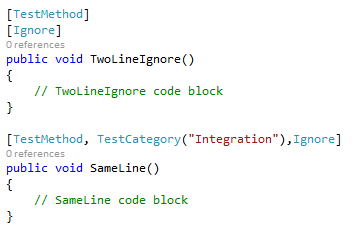

# MSTest2XUnit

<!-- Replace this badge with your own-->

<!-- Update the VS Gallery link after you upload the VSIX-->
Download this extension from the [VS Gallery](https://visualstudiogallery.msdn.microsoft.com/[GuidFromGallery])
or get the [CI build](http://vsixgallery.com/extension/dd067b6f-96bd-4d0d-be4b-cd0d62fc66b8/).

---------------------------------------

This extension allows to migrate a test suite written with MSTest to XUnit.net 2.
It is based on [dotnet/codeformatter](https://github.com/dotnet/codeformatter) with some additional converters. The dotnet converter didn't remove some elements and were letting too much manual refactoring that could have still been automated.

See the [changelog](CHANGELOG.md) for changes and roadmap.

## Features

- Removes TestClass attribute
- Replace MSTest Asserts calls with XUnit.Asserts calls
- Replace Ignore attributes with Skipped Fact attributes
- Replace TestCategory attributes with Trait attributes
- Replace ExpectedException with Assert.Throws<> wrapped block
- Remove MSTest reference and add XUnit nuget packages

### TestClass attribute
Before launching the command:   
    
    
    
After the command:   

### Ignore attributes
Before launching the command:    
    
After the command:   
    

### Assert calls
Before launching the command:    
    
After the command:   

### TestCategory attributes
Before launching the command:    
    
After the command:    
    

### ExpectedException attribute
Before launching the command:    
    
After the command:    

### References
Before launching the command:    
    
    
After the command:    
    
    

For cloning and building this project yourself, make sure
to install the
[Extensibility Tools 2015](https://visualstudiogallery.msdn.microsoft.com/ab39a092-1343-46e2-b0f1-6a3f91155aa6)
extension for Visual Studio which enables some features
used by this project.